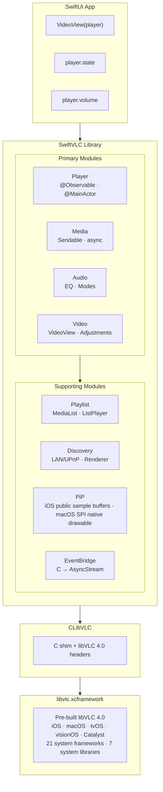
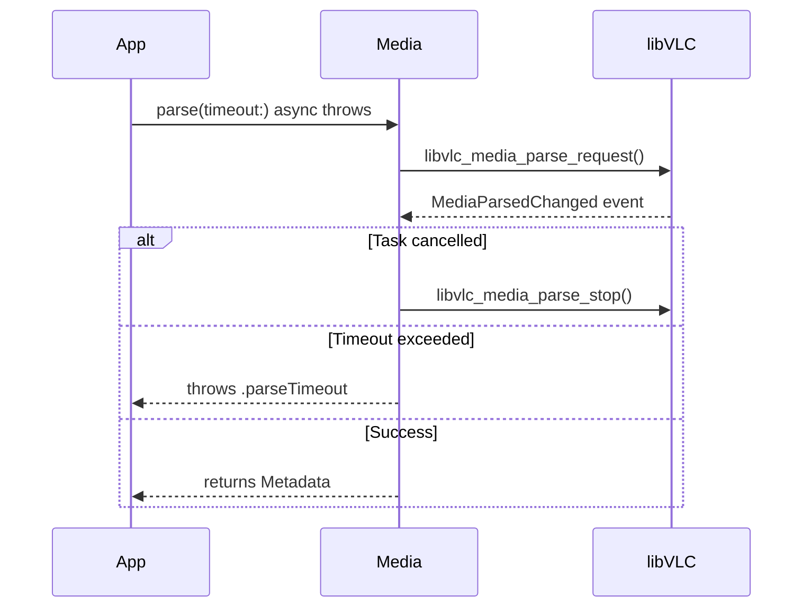
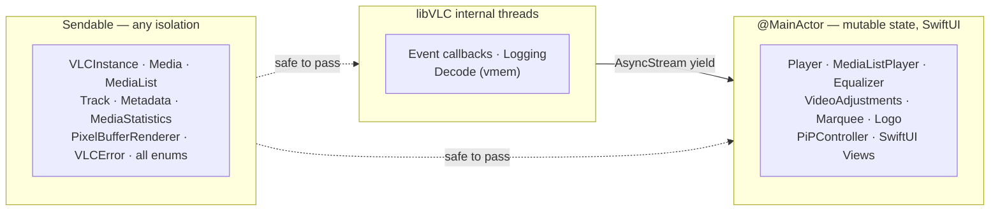
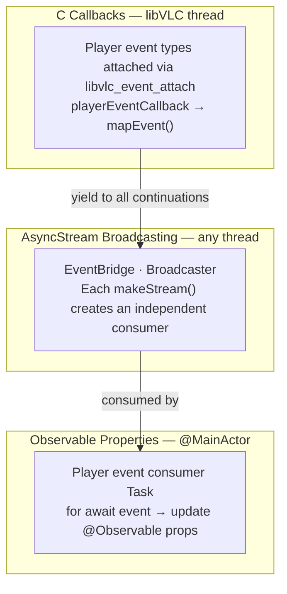
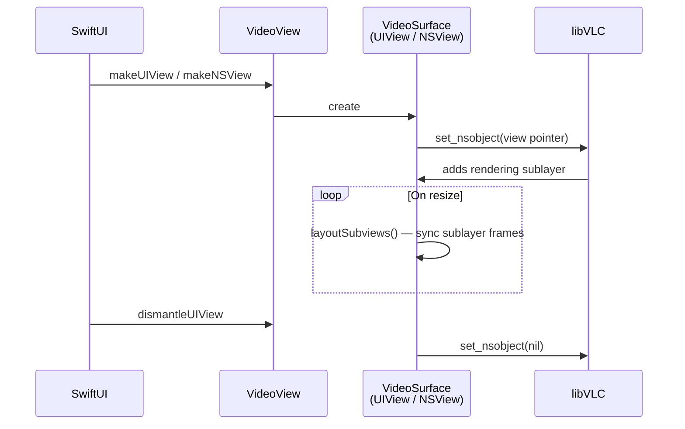
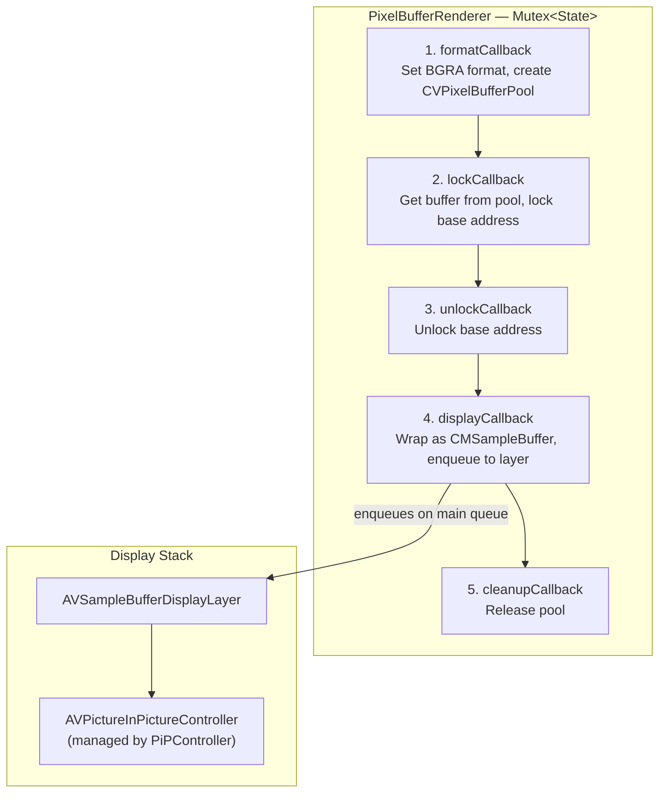

# Architecture

Technical decisions and design rationale for SwiftVLC, written for
contributors and reviewers.

> Looking for **how to use** SwiftVLC? See the DocC guides (published on
> Swift Package Index) or run `swift package preview-documentation
> --target SwiftVLC` locally. This document covers the *why* behind the
> design: build/release infrastructure, C-interop patterns, isolation
> choices, deinit ordering, and the testing strategy.

## Contents

- [High-Level Overview](#high-level-overview)
- [Tech Stack](#tech-stack)
- [Module Architecture](#module-architecture)
- [C Interop Layer](#c-interop-layer)
- [Concurrency & Threading Model](#concurrency--threading-model)
- [Event System](#event-system)
- [Memory Management](#memory-management)
- [Video Rendering](#video-rendering)
- [Picture-in-Picture](#picture-in-picture)
- [Error Handling](#error-handling)
- [Testing Strategy](#testing-strategy)
- [Build & Release Infrastructure](#build--release-infrastructure)
- [Project Structure](#project-structure)

---

## High-Level Overview



**Key concepts:**

- **Swift-first**: Direct C → Swift bindings, no Objective-C intermediary (unlike VLCKit)
- **Observable state**: `@Observable` `@MainActor` Player drives SwiftUI updates automatically
- **Typed concurrency**: Swift 6 strict concurrency. Main-actor types own UI-adjacent C resources, and cross-actor resource/value types are `Sendable`.
- **One-liner rendering**: `VideoView(player)` covers the setup, delegate wiring, and callbacks in one call.
- **Typed errors**: `throws(VLCError)` for compile-time error handling

---

## Tech Stack

| Component | Choice | Why |
|---|---|---|
| **Language** | Swift 6.3+ | Strict concurrency, typed throws, `@Observable`, upcoming feature flags |
| **C Bindings** | libVLC 4.0 C API | Direct access, no Objective-C overhead |
| **State** | `@Observable` / `@MainActor` | Automatic SwiftUI integration, thread safety |
| **Events** | `AsyncStream<PlayerEvent>` | Native structured concurrency, multi-consumer |
| **Video** | `UIView` / `NSView` via `set_nsobject` | Platform-native rendering, zero-copy |
| **PiP** | iOS: vmem → `AVSampleBufferDisplayLayer`; macOS: native drawable backend behind SPI | Public iOS PiP plus explicit private-API macOS opt-in |
| **Thread Safety** | `Mutex<T>`, `Sendable`, `nonisolated(unsafe)` | Compile-time data race prevention |
| **Testing** | Swift Testing framework | Modern `@Test`, `#expect`, tags, traits |
| **Platforms** | iOS 18+, macOS 15+, tvOS 18+, visionOS 2+, Mac Catalyst | Unified SwiftUI minimum |

---

## Module Architecture

### Core

Foundation types shared across all modules.

| File | Type | Purpose |
|---|---|---|
| `VLCInstance.swift` | `final class VLCInstance: Sendable` | Manages `libvlc_instance_t*` lifecycle. Singleton `shared` or custom with arguments. Owns the per-instance `dialogRegistration` Mutex. |
| `VLCError.swift` | `enum VLCError: Error, Sendable, Equatable, Hashable, LocalizedError, CustomStringConvertible` | Typed errors with hand-rolled per-case accessors (`error.parseTimeout`, `error.mediaCreationFailed`, …). Auto-synthesized `Equatable`/`Hashable` over `String` payloads. |
| `Broadcaster.swift` | `final class Broadcaster<Element: Sendable>` | Internal multi-consumer fan-out used by the dialog, renderer, log, player-event, and playback-intent streams. Exposes `subscribe`, `broadcast`, `finishAll` (allows resubscribe) and `terminate` (permanent — future `subscribe` calls return immediately-finished streams) inside the module. Lifecycle reconciliation runs on a private serial queue. |
| `DialogHandler.swift` | `final class DialogHandler: Sendable` | Bridges libVLC's dialog callbacks (`login`, `question`, `progress`, `error`) onto a `Broadcaster<DialogEvent>`. `DialogID` carries the dialog handle through `DialogIDStorage` for safe `dismiss()` + post calls. |
| `Logging.swift` | `AsyncStream<LogEntry>` via `LogBroadcaster` | Filterable log stream backed by `Broadcaster<LogEntry>`. C shim formats `va_list` before Swift callback. `LogNoiseFilter` demotes known-noisy libVLC errors to warnings. |
| `Signposts.swift` | `enum Signposts` | Process-wide `OSSignposter` for `org.swiftvlc` subsystem. Hot paths (`Broadcaster.broadcast`, `Player.handleEvent`, `EventBridge.callback`, `PixelBufferRenderer.outputPixelBuffer`) emit signposts visible in Instruments. Zero cost when no profiler is attached. |
| `Duration+Extensions.swift` | Extensions on `Duration` | `milliseconds`, `microseconds` properties and `formatted` display string |

**Default VLC arguments:** `["--no-video-title-show", "--no-snapshot-preview"]`. `--no-stats` is *not* in the defaults — leaving it on would silently zero every `Media.statistics()` read, which is almost never what a caller wants. On macOS the default keeps VLC's Apple sample-buffer display available for inline playback, including its paired subtitle layer. The private native-drawable PiP backend is present for explicitly opted-in non-App-Store builds, but it is SPI and disabled by default.

### Player

The central observable type that drives all playback.

| File | Type | Purpose |
|---|---|---|
| `Player.swift` | `@Observable @MainActor class` | Wraps `libvlc_media_player_t*`. Lifecycle, drawable management, media loading, and core playback control. Extension files group audio, chapters, events, overlays, programs, recording, typed values, and native-lifecycle helpers. |
| `Player+Events.swift` | `extension Player` | The libVLC event-consumer task and `handleEvent(_:)` dispatch — pause-transition state machine, deferred-pause command, native-state probing, media-derived state reset. |
| `Player+Audio.swift` | `extension Player` | Audio-output device selection, role, mix mode, stereo mode. |
| `Player+Chapters.swift` | `extension Player` | Title/chapter navigation, DVD menu actions. |
| `Player+ABLoop.swift` | `extension Player` | A-B loop state plus checked time/position mutations. |
| `Player+Programs.swift` | `extension Player` | DVB/MPEG-TS program selection and scrambled-state polling. |
| `Player+Recording.swift` | `extension Player` | Snapshot capture and recording start/stop. |
| `Player+Overlays.swift` | `extension Player` | Scoped `withMarquee`/`withLogo`/`withAdjustments` accessors for the `~Copyable ~Escapable` overlay types. |
| `Player+Typed.swift` | `extension Player` | Typed read-only accessors for raw `position`/`volume`/`rate`/`subtitleTextScale`, plus explicit checked mutation methods such as `setPlaybackRate(_:)`. |
| `PlaybackValues.swift` | 5 typed wrapper structs | `PlaybackPosition`, `Volume`, `PlaybackRate`, `SubtitleScale`, `EqualizerGain`. Each is `Sendable, Hashable, Comparable, ExpressibleByFloatLiteral`, clamps finite input to its valid range, and maps `NaN` to a safe named default. |
| `EventBridge.swift` | `internal class` | C callbacks → `Broadcaster<PlayerEvent>` multi-consumer broadcaster. |
| `PlayerState.swift` | `enum PlayerState` | `.idle`, `.opening`, `.buffering`, `.playing`, `.paused`, `.stopped`, `.stopping`, `.error`. Buffer fill is exposed separately as `Player.bufferFill` so `.paused` players still publish progress. |
| `PlayerEvent.swift` | `enum PlayerEvent` | Typed Swift cases mapped from libVLC's player event types. Hand-rolled per-case accessors (`event.stateChanged`, `event.timeChanged`, …). |
| `PlayerRole.swift` | `enum PlayerRole` | Audio behavior hints: `.music`, `.video`, `.communication`, `.game`, etc. |
| `ABLoop.swift` | `enum ABLoopState` | `.none` → `.pointASet` → `.active` |
| `NavigationAction.swift` | `enum NavigationAction` | DVD/Blu-ray menu: `.activate`, `.up`, `.down`, `.left`, `.right`, `.popup` |
| `Program.swift` | `struct Program` | DVB/MPEG-TS program: id, name, isSelected, isScrambled |

**Player API surface:**

```swift
// Observable properties (auto-update SwiftUI)
player.state              // PlayerState
player.currentTime        // Duration
player.duration           // Duration?
player.isSeekable         // Bool
player.isPausable         // Bool
player.currentMedia       // Media?
player.audioTracks        // [Track]
player.videoTracks        // [Track]
player.subtitleTracks     // [Track]

// Playback observations
player.position           // Double (0.0–1.0), read-only
player.volume             // Float (0.0–1.25), read-only requested volume shadow
player.rate               // Float (current libVLC rate), read-only
player.audioDelay         // Duration, read-only
player.subtitleDelay      // Duration, read-only
player.subtitleTextScale  // Float, read-only

// Mutable properties
player.isMuted            // Bool
player.selectedAudioTrack // Track?
player.selectedSubtitleTrack // Track?
player.aspectRatio        // AspectRatio

// Checked mutations for read-only playback observations
try player.seek(to: PlaybackPosition(0.5))
try player.setAudioVolume(0.8)
try player.setPlaybackRate(1.5)
try player.setAudioDelay(.milliseconds(30))
try player.setSubtitleDelay(.milliseconds(-100))
player.setSubtitleScale(1.25)

// Playback control
try player.play(url: someURL)
player.pause()
player.resume()
try player.seek(to: .seconds(30))
try player.seek(by: .seconds(-10))
player.stop()

// Advanced
try player.setABLoop(a: .seconds(10), b: .seconds(20))
try player.takeSnapshot(to: path, width: 320, height: 240)
player.startRecording(to: directoryPath)
try player.updateViewpoint(Viewpoint(yaw: 90, pitch: 0, roll: 0, fieldOfView: 80))
```

### Media

Media resource creation, parsing, and metadata.

| File | Type | Purpose |
|---|---|---|
| `Media.swift` | `final class Media: Sendable` | Wraps `libvlc_media_t*`. Create from URL, path, or file descriptor. Async parsing with cancellation. |
| `Metadata.swift` | `struct Metadata: Sendable` | libVLC's metadata keys surfaced as typed properties (title, artist, album, duration, artworkURL, genre, …) |
| `Track.swift` | `struct Track: Sendable` | Audio/video/subtitle track info with type-specific fields (channels, resolution, encoding) |
| `ThumbnailRequest.swift` | Extension on `Media` | `thumbnail(at:width:height:crop:timeout:) async throws → Data` |
| `MediaStatistics.swift` | `struct MediaStatistics: Sendable` | Runtime stats: decoded/displayed/lost frames, bitrates, buffer counts |

**Parsing flow:**



### Audio

Audio output, equalization, and channel configuration.

| File | Type | Purpose |
|---|---|---|
| `AudioOutput.swift` | `struct AudioOutput`, `struct AudioDevice` | Available output modules and devices. Extensions on `VLCInstance` and `Player`. |
| `Equalizer.swift` | `@Observable @MainActor class Equalizer` | 10-band EQ with preamp (-20 to +20 dB). libVLC's built-in presets. Attach via `player.equalizer`; mutations re-apply automatically. |
| `AudioChannelMode.swift` | `enum StereoMode`, `enum MixMode` | Stereo/mono/Dolby, 4.0/5.1/7.1/binaural mixing |

### Video

Video rendering, overlays, and adjustments.

| File | Type | Purpose |
|---|---|---|
| `VideoView.swift` | SwiftUI `UIViewRepresentable` / `NSViewRepresentable` | One-liner: `VideoView(player)`. Platform-specific `VideoSurface` underneath. |
| `AspectRatio.swift` | `enum AspectRatio` | `.default`, `.ratio(w, h)`, `.fill` |
| `VideoAdjustments.swift` | `@MainActor struct VideoAdjustments` | brightness, contrast, hue, saturation, gamma — accessed via `player.adjustments` |
| `Marquee.swift` | `@MainActor struct Marquee` | Scrolling text overlay: text, color, opacity, position, timeout |
| `Logo.swift` | `@MainActor struct Logo` | Image overlay: file path, position, opacity, animation |
| `Viewpoint.swift` | `struct Viewpoint: Sendable` | 360° video: yaw, pitch, roll, fieldOfView (degrees) |

### Playlist

Playlist management and sequential/looped playback.

| File | Type | Purpose |
|---|---|---|
| `MediaList.swift` | `final class MediaList: Sendable` | Thread-safe list wrapping `libvlc_media_list_t*`. Append/insert/remove with internal locking. |
| `MediaListPlayer.swift` | `@MainActor class MediaListPlayer` | Sequential playback with `play(at:)`, `next()`, `previous()` |
| `PlaybackMode.swift` | `enum PlaybackMode` | `.default`, `.loop`, `.repeat` |

### Discovery

Network service and renderer discovery.

| File | Type | Purpose |
|---|---|---|
| `MediaDiscoverer.swift` | `final class MediaDiscoverer: Sendable` | Discovers media on LAN/SMB/UPnP/SAP. Returns `MediaList` of found items. |
| `RendererDiscoverer.swift` | `final class RendererDiscoverer: Sendable` | Discovers renderer devices exposed by libVLC plugins. `AsyncStream<RendererEvent>` for add/remove. |

### PiP (iOS/macOS only)

Picture-in-Picture uses the platform path that best matches libVLC's
video output. iOS uses public AVKit sample-buffer PiP. macOS has a
native-drawable backend behind `PrivateMacOSPiP` SPI because the public
sample-buffer mirror crops incorrectly on supported macOS releases. The
module is split into 5 focused files.

| File | Type | Purpose |
|---|---|---|
| `PiPController.swift` | `@MainActor class PiPController` | PiP lifecycle, timebase sync, deferred-pause state machine, native-state observer task. |
| `PiPController+Delegate.swift` | extension + private `PiPPlaybackDelegateProxy` | `AVPictureInPictureControllerDelegate` conformance plus the sample-buffer playback delegate proxy that breaks AVKit's strong-retain cycle (AVKit captures the playback delegate strongly even though the header declares it `weak`). Also hosts the `pipMainActorSync` helper for non-main AVKit callbacks that need synchronous main-actor answers. |
| `PiPVideoView.swift` | SwiftUI representable | `PiPVideoView(player, controller: $binding)` — iOS hosts an `AVSampleBufferDisplayLayer`; macOS hosts native drawable containers whose PiP start path is unavailable unless the SPI opt-in is enabled. |
| `PiPVideoView+MacPrivate.swift` | macOS-only private API plumbing | `MacNativePiPBackend` orchestrates `MacPrivatePiPPresenter` (dynamic loader for `PIPViewController` from `PIP.framework`), `MacPrivatePiPDelegate`, and `MacNativePiPMediaController`. All private-framework symbol references live in this one file for security/audit review. Gated by `PiPController.allowsPrivateMacOSAPI` SPI. |
| `PixelBufferRenderer.swift` | `class PixelBufferRenderer: Sendable` | iOS/direct sample-buffer path: format → lock → unlock → display. `CVPixelBufferPool` → `CMSampleBuffer` → layer. |

---

## C Interop Layer

### CLibVLC Target

```
Sources/CLibVLC/
├── include/vlc/          # Full libVLC 4.0 C headers
│   ├── vlc.h             # Main umbrella header
│   ├── libvlc.h          # Instance, logging, dialogs
│   ├── libvlc_media.h    # Media creation, parsing, metadata
│   ├── libvlc_media_player.h  # Player, tracks, events
│   ├── libvlc_media_list.h    # Playlist
│   ├── libvlc_media_discoverer.h  # Network discovery
│   ├── libvlc_renderer_discoverer.h  # Renderer discovery
│   ├── libvlc_picture.h  # Thumbnail generation
│   └── libvlc_events.h   # Event types
└── shim.c                # C shim for va_list formatting
```

### Why a C Shim?

Swift cannot directly consume C variadic functions (`va_list`). The shim provides:

```c
// shim.c — formats va_list into a fixed buffer before calling Swift
void swiftvlc_log_set(libvlc_instance_t *instance, void *opaque,
                       swiftvlc_log_cb callback);
```

This allows the logging callback to receive a pre-formatted `const char *` instead of a `va_list`.

### Linked Frameworks & Libraries

The xcframework links against the system frameworks and libraries
libVLC needs for decoding, rendering, and platform services:

**Frameworks:** AudioToolbox, AudioUnit\*, AVFoundation, AVKit, CoreAudio, CoreFoundation, CoreGraphics, CoreImage, CoreMedia, CoreServices, CoreText, CoreVideo, Foundation, IOKit\*, IOSurface, OpenGL\*, OpenGLES\*, QuartzCore, Security, SystemConfiguration, VideoToolbox

**Libraries:** libbz2, libc++, libiconv, libresolv, libsqlite3, libxml2, libz

\*Platform-conditional: AudioUnit/IOKit/OpenGL are macOS-only; OpenGLES is iOS/tvOS/visionOS-only.

---

## Concurrency & Threading Model

### Isolation Strategy



**Rules:**

1. **`@MainActor` types** own mutable state that SwiftUI observes. All property access and mutation happens on the main actor.
2. **`Sendable` types** are either immutable value types or use internal synchronization (`Mutex<T>`, libVLC's own locks).
3. **C callbacks** fire on libVLC's internal threads. They yield values into `AsyncStream` continuations (which are thread-safe) or hop to the main actor where UI-adjacent state must change.
4. **`nonisolated(unsafe)`** is used for `OpaquePointer` fields that are only valid during the object's lifetime and accessed on the correct actor.

### Capturing C Pointers in `@Sendable` Closures

`OpaquePointer` and `UnsafeMutableRawPointer` aren't `Sendable` under Swift's region-based isolation, so getting them into `@Sendable` closures (`withTaskCancellationHandler` `onCancel`, `DispatchQueue.*.async`) needs one of two mechanisms:

- **`nonisolated(unsafe) let` local binding**, for captures into a single closure. The local opts out of isolation checking; the pointer is trivially transferable and stays valid for the enclosing scope. Used in `Media.parse`, `Player.deinit`, `MediaListPlayer.deinit`, `PixelBufferRenderer`, and the deinits in `DialogHandler`, `RendererDiscoverer`, and `MediaDiscoverer`.
  ```swift
  nonisolated(unsafe) let p = pointer
  DispatchQueue.global(qos: .utility).async {
    libvlc_media_player_release(p)
  }
  ```

- **`Mutex<State>` with `State: @unchecked Sendable`**, for persistent storage of pointers that must be read or written from multiple threads. `Mutex`'s `sending` semantics require `State` to be sendable to the callee; marking `State: @unchecked Sendable` honors that while the `Mutex` itself provides the actual mutual exclusion. Used throughout the library — log-bridge installation state, thumbnail-request coordination, pixel-buffer renderer state, dialog-handler registration, broadcaster subscriber tables.
  ```swift
  private struct State: @unchecked Sendable {
    var selfBox: UnsafeMutableRawPointer?
  }
  private let state = Mutex(State())
  ```

Never use `Int(bitPattern:)` round-trips to launder pointers through `Sendable`. It loses type information and obscures intent.

---

## Event System

Three-layer architecture bridging C callbacks to SwiftUI:



### PlayerEvent Cases

libVLC's player event types are attached to the event manager and mapped to typed Swift cases:

| Category | Swift Cases |
|---|---|
| **State** | `stateChanged(PlayerState)`, `mediaStopping`, `encounteredError` |
| **Time** | `timeChanged(Duration)`, `positionChanged(Double)`, `lengthChanged(Duration)` |
| **Capability** | `seekableChanged(Bool)`, `pausableChanged(Bool)` |
| **Tracks** | `tracksChanged`, `mediaChanged` |
| **Buffering** | `bufferingProgress(Float)` |
| **Audio** | `volumeChanged(Float)`, `muted`, `unmuted`, `corked`, `uncorked`, `audioDeviceChanged(String?)` |
| **Video** | `voutChanged(Int)`, `snapshotTaken(String)` |
| **Chapters** | `chapterChanged(Int)`, `titleListChanged`, `titleSelectionChanged(Int)` |
| **Recording** | `recordingChanged(isRecording:filePath:)` |
| **Programs** | `programAdded(Int)`, `programDeleted(Int)`, `programSelected(unselectedId:selectedId:)`, `programUpdated(Int)` |

### Multi-Consumer Broadcasting

`Broadcaster<Element: Sendable>` (in [`Sources/SwiftVLC/Core/Broadcaster.swift`](Sources/SwiftVLC/Core/Broadcaster.swift)) consolidates this pattern for player events, log entries, dialog callbacks, renderer discovery events, and playback intent. Per-subscriber state (continuation, optional filter, lifecycle phase) lives under a single `Mutex<State>`, so registration is one lock acquisition. `broadcast` snapshots the matching subscribers under the lock and yields outside it. Yielding resumes a consumer task and acquires its status-record lock; a concurrent task cancellation holds that same lock and calls `onTermination → unsubscribe → acquire Mutex`, so yielding while holding the `Mutex` would produce an AB-BA deadlock.

```swift
final class Broadcaster<Element: Sendable>: Sendable {
  func subscribe(bufferSize: Int? = nil, filter: Filter? = nil) -> AsyncStream<Element>
  func broadcast(_ element: Element)
  func finishAll()  // closes current subscribers; allows resubscribe
  func terminate()  // closes current + auto-finishes future subscribes
}
```

The `terminate()` / `finishAll()` distinction matters because some broadcasters expose `subscribe` indirectly via a *computed* property — e.g. `DialogHandler.dialogs` returns `broadcaster.subscribe()` per access. After a producer is permanently gone (handler whose registration was rejected, discoverer whose pointer is being released), `terminate()` ensures every future `subscribe` call returns an immediately-finished stream so consumers don't hang. `finishAll()` is reserved for lazy producers with `onFirstSubscriber` reconciliation that may re-attach later.

`onFirstSubscriber` and `onLastUnsubscribed` callbacks let lazy producers attach to and detach from their upstream source only when there is actual demand. Both run on a per-broadcaster serial reconciliation `DispatchQueue` so concurrent subscribe/unsubscribe storms can't double-fire either side. The reconciliation is state-machine driven (`idle → scheduledOn → running → idle` and the symmetric off cycle), so a fast unsubscribe after a subscribe still terminates with the right callback.

### Lifecycle

1. **`Player.init()`** creates the `EventBridge` (which owns a `Broadcaster<PlayerEvent>`) and attaches every event type to the libVLC event manager.
2. **`startEventConsumer()`** in `Player+Events.swift` spawns a `Task` that reads the bridge stream and updates the player's `@Observable` properties.
3. **`Player.deinit`** cancels the consumer task, then calls `EventBridge.invalidate()` to detach the C callbacks, finish the continuations, and release the store.

---

## Memory Management

### OpaquePointer Lifecycle

Every libVLC object follows the same pattern: **`init` allocates → use passes pointer → `deinit` releases**. Swift object lifetime owns C pointer lifetime.

| Swift Type | C Pointer | Alloc | Free |
|---|---|---|---|
| `VLCInstance` | `libvlc_instance_t*` | `libvlc_new` | `libvlc_release` |
| `Player` | `libvlc_media_player_t*` | `libvlc_media_player_new` | `libvlc_media_player_release` |
| `Media` | `libvlc_media_t*` | `libvlc_media_new_*` | `libvlc_media_release` |
| `MediaList` | `libvlc_media_list_t*` | `libvlc_media_list_new` | `libvlc_media_list_release` |
| `MediaListPlayer` | `libvlc_media_list_player_t*` | `libvlc_media_list_player_new` | `libvlc_media_list_player_release` |
| `MediaDiscoverer` | `libvlc_media_discoverer_t*` | `libvlc_media_discoverer_new` | `libvlc_media_discoverer_release` |
| `RendererDiscoverer` | `libvlc_renderer_discoverer_t*` | `libvlc_renderer_discoverer_new` | `libvlc_renderer_discoverer_release` |
| `RendererItem` | `libvlc_renderer_item_t*` | `libvlc_renderer_item_hold` | `libvlc_renderer_item_release` |
| `Equalizer` | `libvlc_equalizer_t*` | `libvlc_audio_equalizer_new` | `libvlc_audio_equalizer_release` |

### Unmanaged Patterns

For C callback contexts that need to bridge to Swift objects:

| Pattern | Use Case | Lifetime |
|---|---|---|
| `Unmanaged.passRetained` | Long-lived callback context or broadcaster box (EventBridge, logging, dialogs, renderer discovery) | Explicitly released in cleanup/deinit |
| `Unmanaged.passUnretained` | Short-lived reference (VideoSurface in `set_nsobject`) | Object must outlive the call |

### Deinit Ordering

Ordering in `Player.deinit` is load-bearing: detaching the listeners **before** releasing the player prevents use-after-free when a callback fires during teardown.

1. Cancel event consumer task
2. `EventBridge.invalidate()`
   - Detach the C event listeners
   - Finish all `AsyncStream` continuations
   - Release retained store
3. `libvlc_media_player_stop_async()`
4. `libvlc_media_player_release()`

---

## Video Rendering

### VideoView Architecture



There is no `CALayer` setup, no `MTKView`, and no `AVPlayerLayer` to configure. libVLC handles all rendering internally.

---

## Picture-in-Picture

PiP rendering depends on the platform:

| Path | Pipeline |
|---|---|
| **VideoView** | `set_nsobject` → VLC renders directly into the view |
| **PiP on iOS** | vmem callbacks → `CVPixelBuffer` → `CMSampleBuffer` → `AVSampleBufferDisplayLayer` → PiP |
| **PiP on macOS** | SPI opt-in: `set_nsobject` drawable → same VLC-owned `NSView` is moved into the system PiP presenter |

### iOS/Direct vmem Callback Pipeline



### PiPController Responsibilities

1. **Timebase sync.** Creates a `CMTimebase` and keeps it aligned with the player's state (playing, paused, or rate-shifted).
2. **Duration reporting.** Invalidates the PiP controller once the duration becomes known, which is required before the controls can render.
3. **Playback delegation.** Owns a `PiPPlaybackDelegateProxy` that implements `AVPictureInPictureSampleBufferPlaybackDelegate`, breaking AVKit's strong-retain cycle while routing PiP play, pause, and seek commands into the ``Player``.
4. **State observation.** An observer task distinguishes VLC-initiated state changes from PiP-initiated ones.
5. **Render-size tracking.** The iOS/direct sample-buffer path follows AVKit's render-size callbacks and emits target-sized buffers so live PiP resizing cannot display stale-size frames.
6. **Deferred pause.** Skip-without-blink by deferring the pause via task cancellation.

On macOS, the SPI native backend intentionally bypasses SwiftVLC's vmem
renderer. It gives libVLC a normal `NSView` drawable and deliberately does
not conform that view to VLC's sample-buffer PiP protocols. When the
`PrivateMacOSPiP` SPI opt-in is enabled, entering PiP loads macOS's PiP
presenter at runtime and reparents the exact VLC drawable view into the
floating PiP controller. That keeps video, audio, play/pause intent, and
time on one VLC timeline while avoiding the macOS AVKit sample-buffer
`CALayerHost` mirror that can crop at 1:1 layer size instead of scaling
into the PiP panel.

### Mutually Exclusive

`VideoView` and `PiPVideoView` are mutually exclusive for a given player.
On iOS, `set_nsobject` and vmem callbacks cannot coexist on the same
`libvlc_media_player_t`. On macOS, both views use `set_nsobject`, and
the most recently attached drawable owns VLC's native video output.

---

## Error Handling

### Typed Throws

All throwing operations use `throws(VLCError)`:

```swift
func play() throws(VLCError) {
  guard libvlc_media_player_play(pointer) == 0 else {
    throw .playbackFailed(reason: "libVLC refused to start playback")
  }
}

func parse(timeout: Duration) async throws(VLCError) -> Metadata {
  // ...
  throw .parseTimeout
}
```

### Error Cases

| Error | When |
|---|---|
| `instanceCreationFailed` | `libvlc_new` returns nil |
| `mediaCreationFailed` | `libvlc_media_new_*` returns nil |
| `playbackFailed` | `libvlc_media_player_play` returns non-zero |
| `parseFailed` | Media parsing reports failure status |
| `parseTimeout` | Parsing exceeds specified timeout |
| `trackNotFound` | Track selection fails (invalid track ID) |
| `invalidState` | Operation attempted in wrong state |
| `invalidInput` | Public API argument is outside its documented range |
| `operationFailed` | Generic libVLC operation failure |

All errors conform to `LocalizedError` and `CustomStringConvertible` for logging and user-facing messages.

---

## Testing Strategy

### Overview

A comprehensive **Swift Testing** suite targets the public API surface.
Package tests are integration tests against the real libVLC binary.
Showcase UI tests use XCTest separately.

```
Tests/SwiftVLCTests/
├── Support/
│   ├── TestMedia.swift      # Fixture URLs (bundled resources)
│   └── Tag.swift            # Test tag definitions
├── Fixtures/
│   ├── test.mp4             # 1s, 64x64, with metadata
│   ├── twosec.mp4           # 2s, for seeking tests
│   ├── silence.wav          # Audio-only
│   └── test.srt             # Subtitle file
└── …                        # One test suite per domain area
```

### Test Tags

| Tag | Purpose | Speed |
|---|---|---|
| `logic` | Pure Swift logic, no libVLC | Fast |
| `integration` | Requires `VLCInstance` | Medium |
| `media` | Uses bundled fixture files | Medium |
| `mainActor` | Runs on `@MainActor` | Medium |
| `async` | Async tests with timeout guards | Slow |

### Testing Patterns

**Integration tests with real libVLC.** No mocking; every test creates actual `Player` and `Media` instances:

```swift
@Test(.tags(.integration, .media, .async))
func playAndWaitForState() async throws {
  let player = Player()
  try player.play(url: TestMedia.videoURL)
  // Wait for state change...
}
```

**CI execution.** GitHub Actions runs package tests on `macos-latest`
with Xcode `latest-stable` plus the Swift 6.3.1 open-source toolchain
from swift.org, invoked via `xcrun --toolchain`. Showcase builds run on
`macos-26` with Xcode 26.4 because Xcode's built-in SwiftPM must parse
the Swift 6.3 manifest. The package test step is wrapped by
`scripts/ci-run-with-timeouts.py`, which enforces a 10-minute wall
clock and a 3-minute idle watchdog and sends SIGKILL to the process
group when either fires. Caches cover the libvlc xcframework, compiled
build products, and SPM dependency checkouts.

---

## Build & Release Infrastructure

### Scripts

| Script | Purpose |
|---|---|
| `scripts/setup-dev.sh` | First step for local repo work. Downloads the last-released xcframework into `Vendor/`, flips `Package.swift` to the local-path form, and points the Showcase app at the repo-local Swift package. Flags: `--force` (re-download), `--skip-download` (only flip local references). |
| `scripts/build-libvlc.sh` | Compiles libVLC from VideoLAN source (pinned via `VLC_HASH`) into `Vendor/libvlc.xcframework`. Applies the local VLC source patches described in README. |
| `scripts/fix-duplicate-symbols.sh` | Localizes `_json_parse_error` and `_json_read` in the chromecast plugin, which two VLC plugins each emit. Called automatically by `build-libvlc.sh` and `setup-dev.sh`. |
| `scripts/release.sh` | Cuts a versioned release, uploads the xcframework asset, pins the Showcase app to that exact Swift package version, and advances `main`. |
| `scripts/ci-use-released-xcframework.sh` | CI-only. Rewrites the current `Package.swift` `binaryTarget` to the url+checksum of the latest release tag. Run at CI job start so tests resolve against the same binary a downstream consumer would. |
| `scripts/ci-run-with-timeouts.py` | CI-only. Wraps `swift test` with wall-clock and idle timeouts; SIGKILLs the process group if either fires. |

### Package.swift resolution strategy

Published states (`main` and release tags) carry the remote form of the libvlc `binaryTarget`:

```swift
.binaryTarget(
  name: "libvlc",
  url: "https://github.com/harflabs/SwiftVLC/releases/download/vX.Y.Z/libvlc.xcframework.zip",
  checksum: "<sha256>"
)
```

That keeps the repository's default package state aligned with what downstream SPM consumers resolve. Local repo development flips the manifest back to the on-disk xcframework with `./scripts/setup-dev.sh`, which rewrites only the libvlc `binaryTarget` to:

```swift
.binaryTarget(name: "libvlc", path: "Vendor/libvlc.xcframework")
```

The Showcase apps follow the same split: published states pin `SwiftVLC` by exact release version, while `setup-dev.sh` rewrites the Xcode project to use the repo-local package checkout.

| Context | What `binaryTarget` looks like | Where the xcframework comes from |
|---|---|---|
| Published `main` | `url: + checksum:` of the latest release | GitHub Release asset |
| Local dev after `setup-dev.sh` | `path: "Vendor/libvlc.xcframework"` | `setup-dev.sh` (download) or `build-libvlc.sh` (build) |
| CI | rewritten in-memory to `url: + checksum:` of the latest release | SPM resolves + caches (keyed on checksum) |
| Release tag `vX.Y.Z` | `url: + checksum:` | `release.sh` uploads the zip as a release asset at that URL |
| SPM consumer pinning `X.Y.Z` | Reads the tag's `Package.swift` | SPM resolves + verifies checksum + caches |

### Release flow

`release.sh` creates a real release commit that stays on `main`.

```mermaid
flowchart LR
    BUILD["build-libvlc.sh --all"] --> XCF["Vendor/libvlc.xcframework<br/>(unstripped)"]
    XCF --> RELEASE["release.sh vX.Y.Z"]
    RELEASE --> VERIFY["Verify all required slices present"]
    VERIFY --> STRIP["strip -S"]
    STRIP --> ZIP["ditto -c -k"]
    ZIP --> SUM["swift package compute-checksum"]
    SUM --> COMMIT["Commit on main:<br/>Package.swift → url+checksum<br/>Showcase → exactVersion X.Y.Z"]
    COMMIT --> TAG["git tag vX.Y.Z"]
    TAG --> PUSH_TAG["git push origin vX.Y.Z"]
    PUSH_TAG --> GH["gh release create<br/>+ attached .zip"]
    GH --> PUSH_MAIN["git push origin HEAD:main"]
    PUSH_MAIN --> SPM["main and consumers resolve the same release"]
```



Preflight refuses releases from non-`main` branches, uncommitted changes in `Package.swift` or the Showcase project, pre-existing local or remote tags, and unauthenticated `gh`. If a pre-commit rewrite or post-write sanity check fails, the script restores `Package.swift` and the Showcase project before exiting. The tag is pushed before `main`, so if GitHub Release creation fails, `origin/main` still points at the previous good release; finish the release or delete the tag before retrying. A post-write regex guard verifies that the rewritten `Package.swift` still contains the `CLibVLC` target, catching a malformed replacement before the tag is cut.

### CI/CD

| Workflow | Trigger | Purpose |
|---|---|---|
| `test.yml` | Push to `main` / PR | Lints sources, builds all Showcase schemes, runs package tests with coverage, and checks public API doc coverage. |
| `sanitize.yml` | Push to `main`, selected PR paths, weekly schedule | Runs race, stress, memory, and lifecycle tests under Thread Sanitizer and Address Sanitizer. |
| `claude.yml` | Issue comment / PR mention | Claude Code bot integration. |

---

## Project Structure

```
SwiftVLC/
├── Sources/
│   ├── CLibVLC/                    # C bridging layer
│   │   ├── include/vlc/            # libVLC 4.0 C headers
│   │   └── shim.c                  # va_list formatting shim
│   │
│   └── SwiftVLC/                   # Main library
│       ├── Core/                   # VLCInstance, VLCError, Logging, Duration
│       ├── Player/                 # Player, EventBridge, PlayerState, Events, ABLoop, etc.
│       ├── Media/                  # Media, Metadata, Track, Thumbnails, Statistics
│       ├── Audio/                  # AudioOutput, Equalizer, ChannelModes
│       ├── Video/                  # VideoView, AspectRatio, Adjustments, Marquee, Logo, Viewpoint
│       ├── Playlist/              # MediaList, MediaListPlayer, PlaybackMode
│       ├── Discovery/             # MediaDiscoverer, RendererDiscoverer
│       └── PiP/                   # PiPController, PiPVideoView, PixelBufferRenderer
│
├── Tests/SwiftVLCTests/            # Swift Testing suite, one file per domain
│   ├── Support/                    # TestMedia fixtures, Tag definitions
│   └── Fixtures/                   # Bundled media files (~50 KB)
│
├── Showcase/                       # Platform showcase apps
│   ├── Shared/                     # Launch-arg/accessibility contracts, app icon, and shared showcase resources
│   ├── iOS/                        # Full-featured iOS target/scheme, also enabled for Mac Catalyst
│   ├── macOS/                      # Native macOS target/scheme with Mac-tailored showcases
│   ├── tvOS/                       # Native tvOS target/scheme with TV-tailored showcases
│   ├── visionOS/                   # Native visionOS target/scheme with focused playback coverage
│   └── UITests/
│       ├── iOS/                    # UI tests for the iOS/Catalyst showcase
│       ├── macOS/                  # Native macOS UI tests
│       └── tvOS/                   # Empty tvOS UI-test target shell
│
├── Vendor/                         # libvlc.xcframework (multi-GB unstripped; release zip a few hundred MB)
│
├── scripts/
│   ├── build-libvlc.sh                   # Compile libvlc from source
│   ├── setup-dev.sh                      # Download xcframework for local dev
│   ├── release.sh                        # Cut a versioned release and advance main
│   ├── fix-duplicate-symbols.sh          # Localize duplicate json symbols
│   ├── ci-use-released-xcframework.sh    # CI: point Package.swift at latest release
│   └── ci-run-with-timeouts.py           # CI: wall-clock + idle test timeouts
│
├── .github/workflows/
│   ├── test.yml                   # CI test runner
│   ├── sanitize.yml               # Sanitizer test runner
│   └── claude.yml                 # Claude Code bot integration
│
├── Package.swift                  # SPM manifest (Swift 6.3+)
├── .swiftlint.yml                # Lint configuration
├── .swiftformat                   # Format: 2-space indent
└── README.md                     # User guide
```
